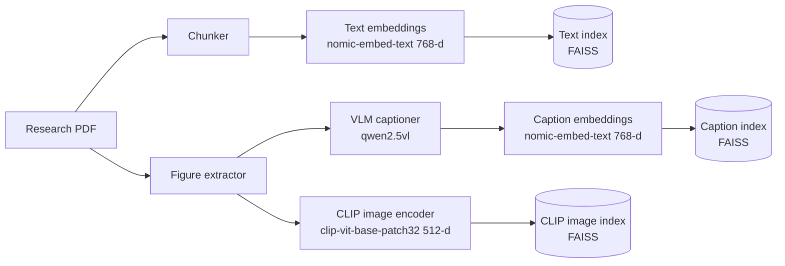
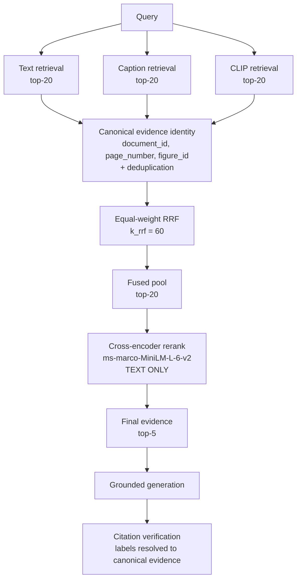

# MRTA — Multimodal Research & Teaching Assistant

An open-source multimodal retrieval, grounding, and evaluation system for
research documents. It combines text, figure-caption, and visual retrieval with
canonical evidence tracking, rank fusion, cross-encoder reranking, grounded
generation, and reproducible evaluation — running entirely locally on Ollama and
FAISS, with no cloud API.

**Frozen v2 retrieval: Recall@5 0.605 · MRR@5 0.515 · Figure Recall@5 0.480**

100-query, five-paper multimodal evaluation benchmark. Strongest of the
[frozen v2 configurations evaluated here](results/v2/pr7/ablation_summary.json) —
not a comparison against external systems or other benchmarks. v2 is a frozen,
versioned evaluation and regression benchmark that informed development, **not**
an untouched held-out test set.

The engineering problem is broader than model choice: how evidence is
represented, how heterogeneous retrieval streams are fused, how duplicate
evidence is prevented from inflating results, how provenance survives into
citations, and how retrieval regressions are detected automatically.

## Architecture

**Index construction** — three indices built independently from the same PDF, never merged:



**Query time** — the pipeline shared by production serving and offline evaluation:



The cross-encoder is a **text** model — it never sees image pixels. Figure
candidates are reranked through their textual representation only.

## Measured results — frozen v2

All ten configurations run under identical conditions. Source:
[`results/v2/pr7/ablation_summary.json`](results/v2/pr7/ablation_summary.json).

| Configuration | Recall@5 | MRR@5 | nDCG@5 | Figure Recall@5 |
|---|---:|---:|---:|---:|
| Text | 0.2950 | 0.3292 | 0.2829 | 0.0000 |
| Caption | 0.3300 | 0.2835 | 0.2644 | 0.5467 |
| CLIP | 0.2900 | 0.1983 | 0.2047 | 0.4800 |
| Text + Caption RRF | 0.5150 | 0.3695 | 0.3894 | 0.4400 |
| Text + CLIP RRF | 0.4700 | 0.2960 | 0.3262 | 0.3600 |
| Caption + CLIP RRF | 0.3400 | 0.2658 | 0.2561 | 0.5467 |
| Text + Caption + CLIP RRF | 0.3400 | 0.2658 | 0.2561 | 0.5467 |
| Text + Caption → CE | 0.5250 | 0.4703 | 0.4565 | 0.3733 |
| **Text + Caption + CLIP → CE** | **0.6050** | **0.5153** | **0.5111** | **0.4800** |

Text-only Figure Recall@5 is `0.0000` by construction — the text stream indexes
body text and returns no figure evidence. A structural zero, not a missing
measurement.

## What the experiments taught us

**1. Complementary visual signal hurt before reranking and helped after it.**
Adding CLIP to Text+Caption changed MRR@5 by **−0.1037** under equal-weight RRF
(0.3695 → 0.2658) and by **+0.0450** after cross-encoder reranking
(0.4703 → 0.5153). On frozen v2, CLIP supplied complementary visual candidates
that equal-weight RRF could not rank effectively; query-aware reranking converted
part of that signal into measurable gains. This is not evidence that RRF
generally fails or that CLIP is universally beneficial —
[detail](docs/architecture/multimodal_reranking_v2.md#14-the-clip-sign-reversal).

**2. Figure representation is associated with a large performance gap.** A large
measured performance gap is associated with figure-text provenance: in the full
reranked configuration, **Figure Recall@5 was 0.7027 for VLM-caption targets
(n=37 queries) versus 0.2632 for nearby-text-fallback targets (n=38 queries)**.
Many scientific figures are vector graphics that raster extraction cannot
recover, so they fall back to adjacent page text. The two groups differ in how
their figures are represented textually; the experiment measures the association,
not its cause —
[detail](docs/architecture/multimodal_reranking_v2.md#17-figure-provenance-analysis).

**3. Fusion can create modality competition.** Under equal-weight three-stream
RRF the text slice collapsed: `text`-intent MRR@5 fell to **0.0000** and hybrid
both-target coverage to **0.00**. A figure reachable through two streams
accumulates RRF evidence a single-stream text chunk cannot match. Reranking
recovered it — all 38 text targets moved into the top-5, mean rank 15.89 → 1.58.
A benchmark-specific interaction in the frozen v2 candidate universe, not
evidence that RRF generally fails —
[detail](docs/architecture/multimodal_reranking_v2.md#15-modality-competition-and-the-text-slice-collapse).

**4. Retrieval quality and citation behaviour are separate optimization
problems.** Higher retrieval metrics did not necessarily translate into higher
citation F1 across the evaluated configurations: adding CLIP raised Recall@5 from
0.5250 to 0.6050 while citation F1 was lower, 0.2685 versus 0.2153. With evidence held byte-identical, structured
citation generation raised citation recall 0.3100 → 0.4300 and F1
0.2203 → 0.3603 while reducing precision 0.5883 → 0.3500 — more citing, and more
of it wrong. Citation completeness is **not** semantic groundedness, and none of
this establishes answer correctness —
[detail](docs/architecture/multimodal_reranking_v2.md#25-generation-and-citation-behaviour).

The engineering conclusion is not "CLIP works" or "RRF fails". It is that
**modality complementarity, candidate generation, fusion, and final ranking are
distinct system-design problems**, and a change that helps one can hurt another.

## Demo

[](https://youtu.be/mxCg96UUFhI)

## Features

- Upload a PDF and build text, caption, and CLIP indices automatically
- Ask questions and receive answers with verified evidence citations
- Five teaching modes: Explain, Socratic, Quiz, Compare, and Visual evidence
- Canonical evidence identity — one physical figure is one citation, however many
  streams retrieved it
- Reproducible offline evaluation over a frozen 100-query benchmark
- Two-tier CI with automatic retrieval-regression detection
- Source-scoped retrieval — Explain figure mode constrains search to the selected document
- Duplicate upload detection — re-uploading the same PDF returns a cached response instantly
- OpenTelemetry tracing — per-request spans with retrieval scores, token counts, and latency
- Fully local: Ollama + Hugging Face, no API keys required
- Typed modules, API/UI separation, Docker, testing, CI, evaluation, and observability

## Prerequisites

**Required:**

- [Docker Desktop](https://www.docker.com/products/docker-desktop)
- [Ollama](https://ollama.com)
- Git

Text model:

```bash
ollama pull llama3.2:latest
```

**Optional** — enables figure and image captioning (~6 GB):

```bash
ollama pull qwen2.5vl:latest
```

The vision model is not required for text-only PDF question answering. When it
is not installed, the **Explain figure** mode falls back to text-based
retrieval and shows an in-app prompt with the install command.

## Quick start

```bash
cp .env.example .env
ollama pull llama3.2:3b
docker compose up --build
```

Optional — enable figure captioning:

```bash
ollama pull qwen2.5vl:7b
```

Open:

- UI: <http://localhost:8501>
- API docs: <http://localhost:8000/docs>

**Demo workflow:**

1. In the sidebar, upload `data/sample/attention_is_all_you_need.pdf`
2. Click **Index document**
3. Ask: *"What problem does self-attention solve?"*

## Python package

The core library is distributed as `mrta-rag` on PyPI:

```bash
# Core only (config, schemas, LLM client, prompts)
pip install mrta-rag

# Add PDF ingestion
pip install "mrta-rag[pdf]"

# Add chunking, embeddings, and FAISS vector search
pip install "mrta-rag[retrieval]"

# Full install (matches the Docker environment)
pip install "mrta-rag[all]"
```

```python
import mrta

print(mrta.__version__)   # 0.1.0

# Core API available after pip install mrta-rag:
from mrta import rag_query, LLMClient, Settings, load_prompt

# Requires mrta-rag[pdf]:
from mrta import load_pdf, chunk_pdf

# Requires mrta-rag[retrieval]:
from mrta import Embedder, VectorStore

# Requires mrta-rag[multimodal]:
from mrta import (
    EvidenceRecord,        # modality-aware schema: text | image | page
    MultimodalCitation,    # structured [T#]/[V#] citation with source + page
    MultimodalAnswer,      # answer + typed text/visual citation lists
    render_page,           # render a single PDF page → EvidenceRecord(modality="page")
    render_pages,          # render all or selected pages
    VisualAnalyzer,        # VLM-based structured figure description
    VisualDescription,     # Pydantic schema + to_retrieval_text() for embedding
    MultimodalRetriever,   # text + caption + CLIP visual retrieval with RRF fusion
    MultimodalRAG,         # full multimodal RAG: retrieve → fuse → VLM → cited answer
    retrieve_multimodal,   # canonical RRF + cross-encoder retrieval (the evaluated stack)
    CanonicalMultimodalRAG,# generation over canonical evidence with verified citations
    VLMClient,             # Ollama vision-language model client
)
```

### Production retrieval pipeline

`retrieve_multimodal()` runs the stack measured in PR1–PR5:

```text
Text ──────┐
Caption ───┼──► canonical RRF ──► top-20 ──► CrossEncoder ──► top-5 ──► generation
CLIP ──────┘                                                              │
                                                                          ├──► text citations
                                                                          └──► figure citations
```

RRF fuses *rank order* across the three streams — raw cosines from different
embedding spaces are never compared. The cross-encoder then scores each
candidate against the query directly; it is a **text** model, so figures are
reranked through their caption or description, never their pixels. One physical
figure retrieved by both the caption and CLIP streams collapses into a single
canonical candidate and a single citation.

Image pixels reach the generator only when the configured model accepts them
and the figure has a verified image asset. A figure's file path is citation
metadata, never prompt content.

## Research engineering & reliability

The multimodal evidence pipeline is treated as an engineered system, not only a
model demo. Every item below is implemented in this repository.

| Concern | How it is handled |
|---|---|
| Evidence identity | Canonical `(document_id, page_number, figure_id)`; one figure retrieved by two streams is one candidate and one citation |
| Provenance | Model selects labels (`T1`, `F2`); the application owns identity. A reply cannot inject a document id, page, figure id, or path |
| Versioned artifacts | Corpus, indices, query embeddings, and baselines committed under `data/eval/` and `results/v2/` |
| Model provenance | Embedding, CLIP, reranker, and generator ids recorded in every result artifact |
| Deterministic evaluation | Frozen benchmark, fixed indices, frozen query embeddings, `temperature=0`; runs offline with no model server |
| Ingestion | An uploaded PDF automatically builds text + caption + CLIP indices ([`document_indexer.py`](src/mrta/ingestion/document_indexer.py)) |
| Graceful degradation | An unavailable retrieval stream or missing image asset yields no candidates rather than failing the query |
| Regression detection | Tier-2 CI replays the frozen benchmark on `main` and fails on drift beyond tolerance |
| Testing | 982 tests; markers separate fast tests from those loading real model weights |
| Serving | FastAPI backend, Streamlit UI, Docker image built and health-checked in CI |
| Observability | OpenTelemetry spans per request — see [`docs/observability.md`](docs/observability.md) |

**Not implemented.** Immutable model-revision pinning (models are pinned by name,
not hub revision hash), access-controlled collections, explicit cost budgets, and
production SLOs are design goals listed under
[future work](docs/architecture/multimodal_reranking_v2.md#24-future-work) — not
current capabilities.

### CI and the regression contract

| Metric | Baseline | Max allowed absolute drop |
|---|---:|---:|
| Recall@5 | 0.6050 | 0.02 |
| MRR@5 | 0.5153 | 0.02 |
| Figure Recall@5 | 0.4800 | 0.03 |

**Tier 1** is a pre-merge quality gate on pull requests — lint, format, types,
fast tests, and a synthetic evaluation smoke check. **Tier 2** is a post-merge
regression detector: it runs on `main`, nightly, and on manual dispatch, so it
makes a regression unmissable but **cannot prevent the commit that caused it from
reaching `main`**.

These are absolute engineering tolerances, **not statistical significance**. The
benchmark is deterministic given fixed indices, so expected drift is zero.

The frozen metrics reproduced identically on macOS arm64 (development) and Linux
x86_64 (GitHub-hosted) — `0.6050 / 0.5153 / 0.4800`, zero drift, across both cold
and warm model-cache states. That is measured agreement on these two platforms,
not a general platform-independence claim. See
[ADR-012](docs/adr/ADR-012-two-tier-ci-quality-gates.md).

## Performance profile

**Measurement context is not interchangeable.** All figures below are local
single-process measurements on macOS arm64 (`torch_device: mps`), `torch 2.12.1`,
`sentence-transformers 5.6.0`, Python 3.11.15, unless stated otherwise. They are
**not** production SLOs.

Per-stage, `Text + Caption + CLIP → CE` with generation
([source](results/v2/pr7/ablation_summary.json)):

| Stage | p50 (ms) | p95 (ms) |
|---|---:|---:|
| Retrieval (3 streams) | 56.798 | 61.154 |
| RRF fusion | 0.384 | 0.514 |
| Cross-encoder rerank | 53.420 | 79.376 |
| Generation | 1104.777 | 1982.263 |
| **End-to-end** | **1224.390** | **2092.498** |

Retrieval and reranking together are ~9% of end-to-end latency; generation is
~90%. Measured within one run, not assembled from separate experiments.

Cross-encoder cold vs warm ([source](results/v2/pr5_reranker_metrics.json)):

| Measurement | Value |
|---|---:|
| Model load (one-off, cold) | 11.6853 s |
| First-inference warm-up | 0.4427 s |
| Steady-state mean per query | 43.856 ms |
| Steady-state p50 / p95 | 37.560 / 70.513 ms |
| Candidate pool | 20 per query (2000 pairs over 100 queries) |
| Throughput | 456.04 pairs/s |

Cold load is ~266× the warm per-query cost; the two are never averaged. The PR5
and PR7 rerank figures differ because they were taken under different conditions
and are not combined.

Evaluation runtime:

| Run | Time | Context |
|---|---:|---|
| `full_reranked`, offline | 5.3 s | local, frozen query cache |
| `full_reranked`, hosted | 45.5 s | GitHub Actions, ubuntu-latest |
| Full 10-config retrieval sweep | ~15 s | local, retrieval-only |

Model memory footprint is not persisted in any artifact and is therefore not
reported here.

## Development

### Local setup (without Docker)

```bash
python -m venv .venv
source .venv/bin/activate  # Windows: .venv\Scripts\activate
pip install -e ".[all]"
```

Run the backend and frontend in separate terminals:

```bash
uvicorn apps.api.main:app --reload --port 8000
streamlit run apps/streamlit/app.py
```

### Apple Silicon: FAISS + PyTorch segfault

On macOS ARM, `faiss-cpu` and `torch` each ship their **own** copy of
`libomp.dylib`. Loading both into one process gives you two OpenMP runtimes, and
the second library to initialise segfaults — typically as a silent `SIGSEGV`
(exit 139) the moment a real PyTorch model is built after FAISS has been
imported. Upstream: [pytorch#149201](https://github.com/pytorch/pytorch/issues/149201).

Check whether you are affected:

```bash
DYLD_PRINT_LIBRARIES=1 python -c "import faiss, torch" 2>&1 | grep -i libomp
```

Two paths means you will hit it. Point FAISS at PyTorch's copy so the process
has exactly one OpenMP runtime:

```bash
cd "$(python -c 'import site; print(site.getsitepackages()[0])')"
cp -p faiss/.dylibs/libomp.dylib faiss/.dylibs/libomp.dylib.orig   # backup
ln -sf ../../torch/lib/libomp.dylib faiss/.dylibs/libomp.dylib
```

Verify — this should print one path, and exit 0:

```bash
DYLD_PRINT_LIBRARIES=1 python -c "import faiss, torch" 2>&1 | grep -i libomp
python -c "
import faiss, torch
from torch import nn
for _ in range(100):
    nn.Parameter(torch.randn(257, 1024))
print('OK')
"
```

Notes:

- Reinstalling or upgrading `faiss-cpu` restores its vendored copy and brings
  the crash back; re-apply the symlink. Revert with
  `mv faiss/.dylibs/libomp.dylib.orig faiss/.dylibs/libomp.dylib`.
- Avoid `KMP_DUPLICATE_LIB_OK=TRUE` — it permits two runtimes to coexist without
  making them safe. `OMP_NUM_THREADS=1` also avoids the crash but serialises all
  OpenMP work in both libraries.
- Linux and CI are unaffected, so this will not show up in GitHub Actions.

### Environment switching

Config is loaded from `configs/{MRTA_ENV}.yaml`, with env vars and `.env`
taking priority:

```bash
MRTA_ENV=test pytest   # lighter models, fast CI
MRTA_ENV=dev pytest    # full dev config
```

### Tests

```bash
pytest                    # everything
pytest -m "not heavy"     # skip tests that download model weights
pytest -m heavy           # only those (needs network on a cold cache)
pytest tests/unit/        # unit tests only
pytest tests/evaluation/  # benchmark integrity tests
```

Markers: `unit`, `integration` and `eval` are applied automatically by directory;
`heavy` is explicit and marks the 22 tests that load real CLIP or
sentence-transformers weights.

### CI tiers

Two tiers, split by what they protect — see
[`ADR-012`](docs/adr/ADR-012-two-tier-ci-quality-gates.md).

Tier 1 is a **pre-merge** quality gate; Tier 2 is a **post-merge** regression
detector. Tier 2 does not run on pull requests, so it must never be configured as
a required PR status check — a required check that can never report leaves every
pull request permanently pending.

**Tier 1** guards the code and runs on every pull request. Reproduce it with:

```bash
ruff check src/ tests/ apps/
black --check src/ tests/ apps/
mypy src/ apps/ --ignore-missing-imports
MRTA_ENV=test pytest -m "not heavy"
python scripts/smoke_eval.py            # synthetic — not a benchmark result
```

**Tier 2** guards the measurement and runs on `main`, nightly, and on demand. It
replays the frozen v2 benchmark and fails if retrieval regressed:

```bash
python scripts/run_ablation.py --configuration full_reranked \
    --retrieval-only --offline --output-dir artifacts/eval

python scripts/check_eval_regression.py --current artifacts/eval/ablation_summary.json
```

`--offline` reads the frozen query vectors in `data/eval/query_embeddings_v2.npz`,
so this needs **no Ollama** and takes about 5 seconds. Gates are absolute metric
points: Recall@5 and MRR@5 may drop at most 0.02, Figure Recall@5 at most 0.03.

Passing Tier 2 means selected frozen retrieval metrics have not regressed on the
v2 benchmark. It does not prove semantic answer correctness or generalization
beyond that benchmark.

Rebuild the query cache only when the benchmark queries or the embedding model
change — both invalidate the frozen baselines:

```bash
python scripts/build_query_embeddings.py --benchmark v2   # requires Ollama
```

### Observability

Tracing is controlled by three `.env` variables:

```bash
ENABLE_TRACING=true           # activate the OTEL SDK
OTEL_CONSOLE_EXPORTER=true    # print spans to stdout (local dev)
OTEL_SERVICE_NAME=mrta
OTEL_EXPORTER_OTLP_ENDPOINT=  # set to export to Jaeger / Tempo
```

With console export enabled, each `/ask` call prints a span to the API logs showing
retrieval scores, cited sources, token counts, and end-to-end latency.

### Linting and type checking

```bash
ruff check src/ tests/ apps/
black --check src/ tests/ apps/
.venv311/bin/mypy src/ apps/ --ignore-missing-imports
```

> **Note:** Use a Python 3.11 virtual environment for `mypy`. The default
> `.venv` uses Python 3.14, whose NumPy stubs use syntax that mypy rejects
> when `python_version = "3.11"` is set. CI uses Python 3.11 and passes.

### Tutorial notebooks

```bash
jupyter lab notebooks/
```

Two parallel versions of the 10-part series:

- **`notebooks/production/`** — imports from `src/mrta/`; the reference implementation
- **`notebooks/tutorials/`** — every function defined inline; use for learning

| # | Phase | Topic |
|---|-------|-------|
| 0 | Setup | Repo scaffold, Ollama, Hugging Face |
| 1 | Ingestion | PyMuPDF text and image extraction |
| 2 | Chunking | Fixed, recursive, and semantic strategies |
| 3 | Embeddings | sentence-transformers + FAISS index |
| 4 | RAG | End-to-end pipeline with citations |
| 5 | Backend | FastAPI endpoints and Pydantic schemas |
| 6 | Frontend | Streamlit upload, ask, cite |
| 7 | Multimodal | Figure extraction, CLIP embeddings, VLM captioning |
| 7b | Multimodal retrieval | Caption store, visual store, RRF fusion |
| 7c | Multimodal RAG | MultimodalRAG, teaching modes, [T#]/[V#] citations |
| 8 | Teaching modes | Explain, Socratic, Quiz, Compare, Visual evidence prompts |
| 9 | Evaluation | Figure Recall@k, multimodal metrics, OTEL spans, Docker |

### Architecture and design decisions

- Tech stack, system diagram, and repo layout: [`docs/architecture/overview.md`](docs/architecture/overview.md)
- Key design decisions (FAISS vs Qdrant, Ollama vs API, etc.): [`docs/adr/`](docs/adr/)

## Limitations

**Benchmark**

- 100 queries across 5 papers, with 21 canonical figures — small.
- **v2 informed system development.** PR4's negative result and PR5's
  intervention were both shaped by observing it. It is a frozen, versioned
  evaluation and regression benchmark, not an untouched held-out test set.
- 21 canonical figures against a per-stream depth of 20 is a structurally
  saturated candidate universe; the modality-competition effect is partly an
  artifact of that ratio.

**Retrieval**

- Figure extraction captures embedded raster images only. Vector-only figures are
  not extracted, so they reach the caption index through nearby page text — which
  is associated with substantially lower Figure Recall@5 (0.2632 versus 0.7027
  for VLM-caption targets).
- The cross-encoder is **text-only**; it reranks figures through their description,
  never their pixels.
- Targets ranked below per-stream depth 20 are unreachable by reranking.
- Hybrid both-target coverage@5 (0.32) still trails the Text+Caption RRF value
  (0.36) despite a large aggregate Recall@5 gain.
- Math is rendered as text; LaTeX-aware parsing would improve recall on
  equation-heavy papers.
- Table extraction is basic.

**Generation and evaluation**

- **Citation metrics are not semantic correctness.** Citation recall measures how
  completely an answer pointed at the expected evidence; nothing here measures
  whether an answer is right.
- G3's improvement comes from a **combined intervention** — structured evidence
  cards *and* a JSON output contract — and cannot be attributed to output format
  alone.
- All generation results are specific to one local generator at `temperature=0`.
- Grounding proxies are lexical and will misjudge paraphrase.

**Engineering**

- Models are pinned by **name, not hub revision hash**. A silent upstream
  re-upload would change results without changing any recorded identifier.
- Persisted index/model compatibility is documented but not enforced; a mismatch
  surfaces as a FAISS dimension assertion.
- No multi-document graph reasoning.
- CI tolerances are engineering thresholds, not statistical significance.

## Documentation

| Document | Contents |
|---|---|
| [Multimodal retrieval architecture](docs/architecture/multimodal_reranking_v2.md) | Authoritative technical description: indexing, fusion, reranking, full ablations, failure analysis, provenance |
| [Architecture overview](docs/architecture/overview.md) | Tech stack, system diagram, repo layout, design tradeoffs |
| [Observability](docs/observability.md) | OpenTelemetry span attributes and setup |
| [ADR-013](docs/adr/ADR-013-modality-specific-retrieval-and-query-aware-reranking.md) | Why modality-specific retrieval and query-aware reranking, with the v2 evidence |
| [ADR-012](docs/adr/ADR-012-two-tier-ci-quality-gates.md) | Two-tier CI and the regression contract |
| [ADR-011](docs/adr/ADR-011-citation-aware-generation.md) | Citation-aware generation and the precision/recall trade-off |
| [ADR-010](docs/adr/ADR-010-ablation-and-generation-evaluation.md) | Ablation framework and generation metrics |
| [All ADRs](docs/adr/) | Full decision history |
| [CHANGELOG](CHANGELOG.md) | Per-PR record of what changed and why |

Every quantitative claim links to a committed artifact under
[`results/v2/`](results/v2/).

## License

This project is licensed under the MIT License. See the [LICENSE](LICENSE) file for details.
