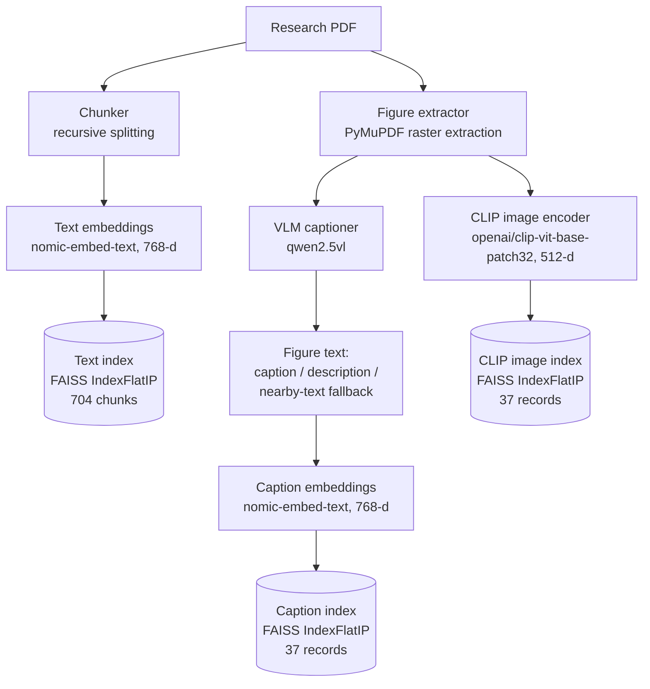
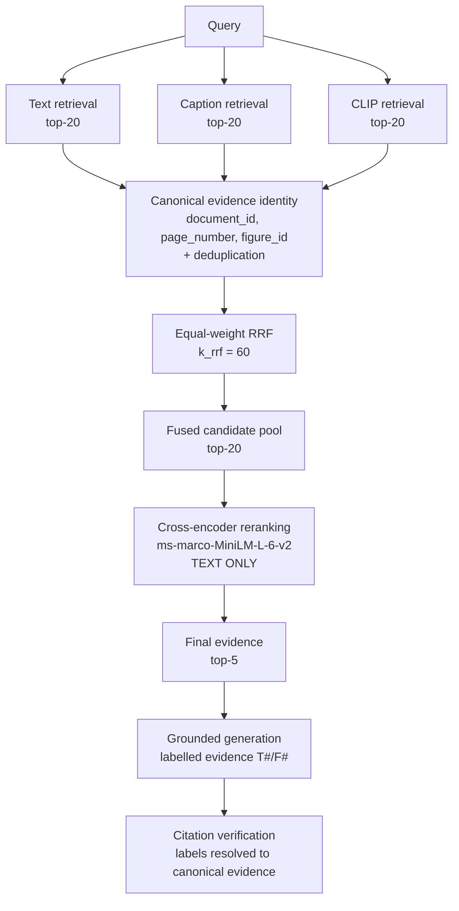

# Multimodal Retrieval and Reranking — Frozen v2 Architecture

Authoritative technical description of MRTA's multimodal retrieval architecture
and the measured evidence behind it.

Scope note: every number here is measured on the **frozen v2 benchmark** and is
linked to a committed artifact under `results/v2/`. Where this document says a
configuration is the *strongest*, it means **the highest-scoring of the frozen v2
configurations evaluated here** — not a comparison against external systems,
other benchmarks, or configurations that were never run.

For tech stack and repository layout see
[`overview.md`](overview.md). For tracing see
[`../observability.md`](../observability.md). For decisions see
[`../adr/`](../adr/), particularly
[ADR-013](../adr/ADR-013-modality-specific-retrieval-and-query-aware-reranking.md).

---

## 1. Purpose and scope

MRTA retrieves evidence from research PDFs across three modalities — body text,
figure captions, and figure images — and generates answers that cite the specific
evidence they used.

This document covers indexing, query-time retrieval, fusion, reranking, and the
evaluation protocol. It does **not** cover generation prompt design
([ADR-011](../adr/ADR-011-citation-aware-generation.md)) or CI
([ADR-012](../adr/ADR-012-two-tier-ci-quality-gates.md)) beyond their retrieval
contract.

The engineering problem is broader than model selection. The recurring questions
are: how is evidence *identified*, how are heterogeneous retrieval streams
*combined*, how is duplicate evidence prevented from *inflating* metrics, how is
provenance *preserved* through generation, and how are regressions *detected*.

## 2. The frozen v2 benchmark

| Property | Value |
|---|---|
| Queries | 100 |
| Papers | 5 (Attention Is All You Need, CLIP, BLIP-2, LLaVA, SigLIP) |
| Text chunks | 704 |
| Canonical figures | 21 |
| Caption records | 37 (multi-crop figures own several) |
| Intents | `text`, `visual_caption`, `visual_layout`, `hybrid`, `hard_visual` |
| Version | `v2.0.0` (`dataset_version`, `corpus_version`) |

**v2 is a frozen, versioned evaluation and regression benchmark — not an
untouched held-out test set.** It informed system development: PR4's negative
result and PR5's intervention were both shaped by observing v2. Results here
describe behaviour *on this benchmark* and should not be read as generalization
estimates.

Queries: [`data/eval/queries_v2.json`](../../data/eval/queries_v2.json) ·
Manifest: [`data/eval/corpus/v2/manifest.json`](../../data/eval/corpus/v2/manifest.json)

## 3. Indexing architecture

Three indices are built independently from the same PDFs. They are never merged.



The caption and CLIP indices cover the **identical 21 canonical figures**, which
is what guarantees no figure candidate reaches the reranker without text.

## 4. Query-time architecture

This is the pipeline shared by production serving and offline evaluation. The one
place they differ is document-id resolution — see §11.



**The cross-encoder never sees image pixels.** Figure candidates are scored
through their textual representation only (§10). This is a query-aware *textual*
reranker over multimodal candidates, not a multimodal reranker.

## 5. Retrieval stream semantics

| Stream | Query encoding | Index | Returns |
|---|---|---|---|
| Text | `nomic-embed-text` 768-d | text FAISS | `Chunk` — page-scoped body text |
| Caption | `nomic-embed-text` 768-d | caption FAISS | `EvidenceRecord` — figure w/ text |
| CLIP | CLIP text encoder 512-d | CLIP image FAISS | `VisualRecord` — figure, no text |

Text and caption share an embedding space; CLIP occupies a different one. Cosines
from a 768-d Ollama space and a 512-d CLIP space are **not comparable**, which is
the direct reason fusion operates on ranks rather than scores (§7).

Each stream degrades independently: an unavailable stream yields no candidates
rather than failing the query
([`canonical_pipeline.py`](../../src/mrta/retrieval/canonical_pipeline.py)).

## 6. Canonical evidence identity

```python
# src/mrta/eval/types.py
class CanonicalEvidence:
    """Stable semantic identity: (document_id, page_number, figure_id)."""
    document_id: str
    page_number: int
    figure_id: str | None = None
```

Matching rule as implemented: if *either* side carries a `figure_id`, all three
fields must match; otherwise document and page suffice.

Three properties this buys, each of which would otherwise corrupt metrics:

- **Duplicate representations of one figure must not inflate results.** A figure
  reachable through both the caption and CLIP streams is *one* piece of evidence.
  Without deduplication it would occupy two of five final slots and be counted
  twice at every cutoff.
- **A figure and the text on its page are different evidence.** Collapsing them
  to page identity would mark a figure query satisfied by retrieving prose.
- **Separate text chunks must not collapse to page identity.** Text evidence is
  page-scoped by benchmark design; chunk-level identity would make Recall depend
  on chunk size.

## 7. Equal-weight reciprocal rank fusion

```
score(d) = Σ_streams 1 / (k_rrf + rank_stream(d))      k_rrf = 60
```

- **Equal weights.** No per-stream weight was tuned; tuning weights against v2
  would convert measurement into selection.
- **`k_rrf = 60`**, the standard value, held at PR4's setting for comparability.
- **Per-stream candidate depth 20.**
- **Raw similarity scores are never blended** — see §5.
- **Canonical deduplication before fusion**, so one figure contributes one entry.
- **Deterministic tie-breaking**, so runs are reproducible.

Implementation: [`fusion.py`](../../src/mrta/retrieval/fusion.py)
(`reciprocal_rank_fusion_canonical`).

## 8. Candidate-pool depth

Depth 20 per stream, 20 into the reranker, 5 evaluated — four distinct k's kept
deliberately separate. Depth is the binding constraint on what reranking can fix:
a target below depth 20 is **unreachable**, no matter how good the reranker is.

PR5 measured this directly on the 20 queries PR4 failed in-pool:

| Configuration | Addressable within depth 20 | Unreachable below depth 20 |
|---|---:|---:|
| `rerank_text_caption` | 10 | 10 |
| `rerank_text_caption_clip` | **17** | **3** |

Adding CLIP did not merely re-rank — it pulled 7 more targets into reachable
range. That is candidate *generation*, a different system-design problem from
ranking.

## 9. Cross-encoder reranking

| Property | Value |
|---|---|
| Model | `cross-encoder/ms-marco-MiniLM-L-6-v2` |
| Modality | **text only** |
| Input | fused top-20 |
| Output | top-5 |
| Score handling | CE score stored on `RerankedCandidate`; RRF score untouched |

The two scores are **never blended**. RRF orders the candidate set entering the
reranker; the cross-encoder is the final ranking stage. Tie-breaking is
deterministic.

Implementation: [`reranker.py`](../../src/mrta/retrieval/reranker.py)
(`CrossEncoderReranker`, additive — the PR-era `Reranker` is untouched).

## 10. Figure textual representation

A `VisualRecord` from the CLIP index carries no text, so CLIP-retrieved figures
would reach a text cross-encoder as empty strings. The frozen policy:

1. Both visual streams take figure text from **one canonical-id lookup** over the
   whole caption index.
2. Text is assembled under explicit labels in priority order:
   `Figure caption:` → `Description:` → `Context:` (nearby-text fallback).
3. Multi-crop figures resolve deterministically: prefer a VLM caption, then the
   lowest `evidence_id`.

Verified total: caption and CLIP indices cover the identical 21 canonical
figures, so **no figure candidate is textless**.

Leakage control: candidate text reaches the model only via
`FusedCandidate.payload`, and only production-derived keys are written there.
Benchmark fields — `source_note`, `expected_evidence`, `retrieval_challenge`,
`difficulty`, canonical figure names — are never written to a payload and
therefore cannot enter model input.

## 11. Provenance preservation, and the production/evaluation distinction

Evidence carries its provenance from retrieval through to a verified citation.
The model selects **labels** (`T1`, `F2`); the application owns canonical
identity. A reply cannot inject a document id, page, figure id, or path — it can
only choose among labels the application assigned.

**The one place production and evaluation differ is document-id resolution**, and
it is deliberate:

| | `document_id` source |
|---|---|
| Production (`canonical_pipeline.py`) | content-hashed `doc_id` assigned at ingestion |
| Evaluation (`EvalAdapter`) | manifest id from `corpus/v2/manifest.json` |

Benchmark targets are written against manifest ids, so evaluation **must** use
`EvalAdapter`. Wiring the production adapter into evaluation makes every metric
read 0.0000 while retrieval works perfectly, because nothing ever matches — this
happened during PR7 and is recorded in
[ADR-010](../adr/ADR-010-ablation-and-generation-evaluation.md) decision 2. The
retrieval architecture either side of that boundary is identical, which is why
§4's diagram covers both.

## 12. Evaluation protocol

- Metrics on the **top-5 slice**. `mean_reciprocal_rank` takes no `k`, so scoring
  the full pool would silently yield MRR@20 and break comparability.
- Failed queries counted separately and excluded from means, so an execution
  error cannot improve an average by dropping a hard query.
- Retrieval-only by default; generation is opt-in.
- Deterministic: fixed indices, `temperature=0`, frozen query embeddings.

Runner: [`scripts/run_ablation.py`](../../scripts/run_ablation.py) ·
Framework: [`src/mrta/eval/`](../../src/mrta/eval/)

## 13. Full ablation results — frozen v2

All ten configurations under identical conditions. Source:
[`results/v2/pr7/ablation_summary.json`](../../results/v2/pr7/ablation_summary.json).

| Configuration | Recall@5 | MRR@5 | nDCG@5 | Figure Recall@5 |
|---|---:|---:|---:|---:|
| Text only | 0.2950 | 0.3292 | 0.2829 | 0.0000 |
| Caption only | 0.3300 | 0.2835 | 0.2644 | 0.5467 |
| CLIP only | 0.2900 | 0.1983 | 0.2047 | 0.4800 |
| Text + Caption RRF | 0.5150 | 0.3695 | 0.3894 | 0.4400 |
| Text + CLIP RRF | 0.4700 | 0.2960 | 0.3262 | 0.3600 |
| Caption + CLIP RRF | 0.3400 | 0.2658 | 0.2561 | 0.5467 |
| Text + Caption + CLIP RRF | 0.3400 | 0.2658 | 0.2561 | 0.5467 |
| Text + Caption → CE | 0.5250 | 0.4703 | 0.4565 | 0.3733 |
| **Text + Caption + CLIP → CE** | **0.6050** | **0.5153** | **0.5111** | **0.4800** |
| *Oracle evidence (diagnostic)* | *1.0000* | *1.0000* | *1.0000* | *1.0000* |

Text-only Figure Recall@5 is `0.0000` by construction: the text stream indexes
body text and returns no figure evidence. It is a structural zero, not a gap in
measurement.

The oracle receives ground-truth evidence by design. Its retrieval metrics are
perfect by construction and **must never** be compared against a retrieval
configuration.

`Text + Caption + CLIP → CE` is the strongest **of these evaluated frozen v2
configurations**.

## 14. The CLIP sign reversal

The same stream addition has opposite signs before and after reranking.

| | Text+Caption | + CLIP | ΔMRR@5 |
|---|---:|---:|---:|
| Under equal-weight RRF | 0.3695 | 0.2658 | **−0.1037** |
| After cross-encoder reranking | 0.4703 | 0.5153 | **+0.0450** |

Source: [`results/v2/pr5_reranker_metrics.json`](../../results/v2/pr5_reranker_metrics.json)
(`overall`, `clip_marginal_value_after_reranking`).

**Interpretation, narrowly.** On frozen v2, CLIP supplied complementary visual
candidates, but equal-weight RRF could not rank that signal effectively.
Query-aware cross-encoder reranking converted part of that complementary signal
into measurable retrieval gains.

**This does not show** that RRF generally fails, that CLIP is universally
beneficial, or that CLIP only works with reranking. It shows that the *value of a
retrieval stream is not a property of the stream alone* — it depends on what
ranks the candidates it produces.

## 15. Modality competition and the text-slice collapse

Under equal-weight three-stream RRF the text slice collapsed.

| Intent | T+C RRF | T+C+CLIP RRF | T+C→CE | T+C+CLIP→CE |
|---|---:|---:|---:|---:|
| `text` | 0.3400 | **0.0000** | 0.5867 | 0.6713 |
| `hybrid` | 0.5780 | 0.4380 | 0.7200 | 0.6933 |
| `visual_caption` | 0.3533 | 0.3375 | 0.3167 | 0.3267 |
| `visual_layout` | 0.2367 | 0.3092 | 0.3100 | 0.4242 |
| `hard_visual` | 0.2200 | 0.2700 | 0.1833 | 0.2400 |

MRR@5 by intent. `text`-intent MRR@5 reaching **0.0000** means no text-intent
query surfaced its target anywhere in the top-5.

Hybrid both-target coverage@5 shows the same shape:

| Configuration | Coverage |
|---|---:|
| Text + Caption RRF | 0.36 |
| Text + Caption + CLIP RRF | **0.00** |
| Text + Caption → CE | 0.32 |
| Text + Caption + CLIP → CE | 0.32 |

**The mechanism.** v2 holds 21 canonical figures against a per-stream depth of
20 — a small, dense figure universe. A figure reachable through *both* the
caption and CLIP streams accumulates RRF evidence from two streams. A body-text
chunk can only ever appear in one. With equal weights and comparable ranks, a
two-stream figure outranks a one-stream text chunk almost mechanically, and the
top-5 fills with figures.

Corroborating this: **Caption + CLIP RRF and Text + Caption + CLIP RRF are
numerically identical across all four reported aggregate top-5 metrics**
(0.3400 / 0.2658 / 0.2561 / 0.5467). Adding the text stream produced **no
measurable change in the reported top-5 aggregate metrics for this frozen
configuration**, which is consistent with the modality-competition analysis.

This does *not* mean text retrieval is unnecessary or contributes nothing. Text
retrieval contributes strongly in other frozen configurations — Text+Caption RRF
reaches Recall@5 0.5150, and the reranked three-stream configuration reaches
0.6050 with `text`-intent MRR@5 at 0.6713. What the identity shows is that under
*this* fusion configuration, on *this* candidate universe, the text stream's
contribution did not survive into the top-5 aggregate.

**Scope.** This was a benchmark-specific interaction in the frozen v2 candidate
universe, not evidence that RRF generally fails. A corpus with more figures
relative to depth, or fewer, would behave differently.

## 16. Reranker recovery

The cross-encoder is query-aware and modality-blind, so it re-scores a displaced
text chunk on its merits rather than on how many streams found it.

Rank movement under `Text + Caption + CLIP → CE`:

| Evidence type | n | Mean rank before | Mean rank after | Promoted into top-5 | Pushed out of top-5 |
|---|---:|---:|---:|---:|---:|
| Text | 38 | 15.89 | **1.58** | **38** | 0 |
| Figure | 72 | 5.75 | 7.65 | 9 | 14 |
| Hybrid queries | 24 | 5.00 | 3.58 | 6 | 1 |

Text targets sat at mean rank ~16 in the fused pool — inside depth 20, but far
outside the top-5. Reranking moved **all 38** into the top-5, median delta −14.

The figure row is the cost, stated plainly: figure evidence moved *down* on
average, and 14 figure targets were pushed out of the top-5. The recovery was not
free.

PR4 push-out recovery, same configuration: of 15 pushed-out targets, 5 restored
to top-5, 4 still below, 6 pushed lower, 0 unreachable.

## 17. Figure-provenance analysis

PR5 measured a large performance gap associated with how a target figure's text
was obtained. The analysis is observational: figures are grouped by the
provenance of their text, not assigned to it, so the gap is an association rather
than a demonstrated cause.

Under `Text + Caption + CLIP → CE`:

| Target figure provenance | n (queries) | Figure Recall@5 | Recall@5 | MRR@5 |
|---|---:|---:|---:|---:|
| VLM caption | 37 | **0.7027** | 0.7162 | 0.5914 |
| Nearby-text fallback | 38 | **0.2632** | 0.3421 | 0.3386 |

**Read these carefully.** `0.7027` and `0.2632` are **Figure Recall@5**, not
Recall@5 — the artifact defines both and they differ. `n` counts **queries whose
target figure has that provenance** (37 and 38 of the 75 figure-target queries),
**not** canonical figures. The canonical-figure split is different again:

| Level | VLM caption | Nearby-text fallback | Total |
|---|---:|---:|---:|
| Canonical figures | 11 | 10 | 21 |
| Caption records | 17 | 20 | 37 |

Four multi-crop figures own both captioned and uncaptioned crops, which is why
the two levels disagree.

**Why the fallback path exists.** Many scientific figures are vector graphics,
not embedded raster images. PyMuPDF raster extraction does not recover them, so
those figures reach the caption index through nearby page text instead of a VLM
caption. Four distinct paths must not be collapsed:

| Path | What it is |
|---|---|
| Raster extraction | embedded bitmap pulled directly from the PDF |
| Page render | full page rasterised as an image |
| Nearby-text fallback | figure text taken from surrounding page prose |
| VLM caption provenance | text generated by a vision model from the image |

A visually specific query against a figure whose only text is adjacent prose is
being matched on text that never describes the figure's content. **Figure
extraction and textual representation are therefore associated with the largest
performance gap measured in these experiments.** Whether a different reranker
would narrow that gap was not evaluated here.

## 18. Hybrid-query behaviour

Hybrid queries expect **both** a text and a figure target. Both-target
coverage@5 is therefore a stricter test than Recall@5.

Coverage collapsed to 0.00 under three-stream RRF and recovered to 0.32 after
reranking (§15), but did not exceed the Text+Caption RRF value of 0.36. Adding
CLIP after reranking left it unchanged at 0.32 while overall Recall@5 rose from
0.5250 to 0.6050 — an aggregate gain that hybrid coverage did not share. Hybrid
MRR@5 is in fact marginally *lower* with CLIP (0.7200 → 0.6933).

Filling five slots with evidence of two kinds is a different optimization problem
from ranking one correct item first, and this architecture does not solve it
explicitly.

## 19. Latency and performance profile

**Measurement context matters and is not interchangeable.** Everything below is
local single-process measurement on macOS arm64 (`torch_device: mps`),
`torch 2.12.1`, `sentence_transformers 5.6.0`, Python 3.11.15. These are **not**
production SLOs and not GitHub-hosted numbers.

### Cross-encoder, warm model (PR5)

Source: [`pr5_reranker_metrics.json`](../../results/v2/pr5_reranker_metrics.json) → `latency`

| Measurement | Value |
|---|---:|
| Model load (one-off, cold) | 11.6853 s |
| First-inference warm-up | 0.4427 s |
| Steady-state mean / query | 43.856 ms |
| Steady-state p50 | 37.560 ms |
| Steady-state p95 | 70.513 ms |
| Candidate pairs reranked | 2000 (100 queries × 20) |
| Throughput | 456.04 pairs/s |

Cold model load is ~266× the steady-state per-query cost. Warm and cold are not
the same number and must not be averaged.

### Per-stage, `Text + Caption + CLIP → CE` (PR7)

Source: [`pr7/ablation_summary.json`](../../results/v2/pr7/ablation_summary.json) → `latency_percentiles`

| Stage | p50 (ms) | p95 (ms) |
|---|---:|---:|
| Retrieval (3 streams) | 56.798 | 61.154 |
| RRF fusion | 0.384 | 0.514 |
| Cross-encoder rerank | 53.420 | 79.376 |
| Generation | 1104.777 | 1982.263 |
| **Total** | **1224.390** | **2092.498** |

Retrieval and reranking together are ~9% of end-to-end latency; generation
dominates at ~90%. Fusion is free. This total is measured within one run, not
assembled from separate experiments.

Note the PR5 and PR7 rerank figures differ (43.9 ms mean vs 53.4 ms p50) because
they were taken under different conditions. They are not combined here.

### Evaluation runtime

| Measurement | Value | Context |
|---|---:|---|
| Full retrieval sweep, 10 configs | ~15 s | local, retrieval-only |
| `full_reranked` offline | 5.3 s | local, frozen query cache |
| `full_reranked` hosted | 45.5 s | GitHub Actions, ubuntu-latest |
| PR7 full run incl. generation | 590.18 s | local |

## 20. Failure analysis

Failure is attributed to the **earliest** failing stage, so a missing citation is
never blamed on the generator when the target never arrived.

Source: [`pr7/ablation_report.md`](../../results/v2/pr7/ablation_report.md)

| Configuration | retrieval_miss | ranking_miss | citation_missing | citation_relevance | answer_support |
|---|---:|---:|---:|---:|---:|
| Text only | 76 | 3 | — | — | — |
| Caption only | 34 | 25 | — | — | — |
| CLIP only | 26 | 38 | — | — | — |
| Text + Caption RRF | 24 | 26 | 29 | 13 | 3 |
| Text + Caption + CLIP RRF | 7 | 52 | 34 | — | 3 |
| Text + Caption → CE | 24 | 29 | 20 | 13 | 2 |
| **Text + Caption + CLIP → CE** | **7** | **36** | **28** | **23** | **1** |

Three things this shows:

- **Failure is distributed, not concentrated.** Only 7/100 queries fail for lack
  of retrievable evidence in the strongest evaluated frozen v2 configuration.
- **Candidate reachability improved dramatically.** `retrieval_miss` falls from
  24 to 7 when CLIP is added — CLIP's contribution is candidate generation.
- **The error relocated rather than disappeared.** `ranking_miss` rises to 52
  under three-stream RRF (the collapse of §15) and falls to 36 after reranking,
  while citation-stage failures grow.

The text-only row is instructive: 76 retrieval misses, but only 3 ranking misses.
When it finds the target it ranks it well; it simply cannot see figures.

Weak nearby-text fallback (§17) and visual-layout queries remain the hardest
cases, and a **text-only cross-encoder is structurally limited** on visual
evidence — it re-scores a figure's description, never the figure.

## 21. Reproducibility and the CI contract

The frozen retrieval contract, enforced on every push to `main`:

| Metric | Baseline | Max allowed absolute drop |
|---|---:|---:|
| Recall@5 | 0.6050 | 0.02 |
| MRR@5 | 0.5153 | 0.02 |
| Figure Recall@5 | 0.4800 | 0.03 |

Baseline: [`results/v2/baselines/retrieval_regression_v1.json`](../../results/v2/baselines/retrieval_regression_v1.json)

These are **absolute engineering tolerances, not statistical significance**. The
benchmark is deterministic given fixed indices, so expected drift is zero; the
tolerance covers library and platform variation.

- **Tier 1** — pre-merge quality gate on pull requests (when configured as a
  required status check).
- **Tier 2** — post-merge regression detector on `main`, nightly, and manual
  dispatch. It does **not** run on pull requests and therefore cannot prevent the
  commit that caused a regression from reaching `main`.

The metrics reproduced identically on macOS arm64 (development) and Linux x86_64
(GitHub-hosted): `0.6050 / 0.5153 / 0.4800`, zero drift, across two platforms and
both cold and warm model-cache states. This is measured cross-platform agreement
on these two platforms — not a general platform-independence claim.

Detail: [ADR-012](../adr/ADR-012-two-tier-ci-quality-gates.md).

## 22. Research-engineering considerations

Implemented and verifiable in this repository:

- Versioned corpus, index, and baseline artifacts committed under `data/eval/`
  and `results/v2/`.
- Explicit model provenance recorded in every result artifact (embedding, CLIP,
  reranker, generator).
- Canonical evidence identity and deduplication (§6).
- Evidence-level citations resolved back to canonical identity (§11).
- Deterministic offline evaluation needing no model server.
- Automatic text + caption + CLIP indexing for newly uploaded PDFs
  ([`document_indexer.py`](../../src/mrta/ingestion/document_indexer.py)).
- Graceful per-stream degradation.
- Per-stage latency measurement (§19).
- Automated unit and integration tests; two-tier CI (§21).
- FastAPI service and Streamlit UI; Docker build validated in CI.
- OpenTelemetry tracing ([`../observability.md`](../observability.md)).

Not implemented — see §24.

## 23. Limitations

- **Benchmark scale.** 100 queries, 5 papers, 21 canonical figures.
- **v2 informed development.** Not an untouched held-out test set.
- **Dense figure universe.** 21 canonical figures against depth 20 is
  structurally saturated; the modality-competition effect of §15 is partly an
  artifact of that ratio.
- **Figure extraction.** Raster-only; vector figures fall back to nearby text,
  which is associated with substantially lower Figure Recall@5 (§17).
- **Text-only cross-encoder.** Cannot inspect pixels.
- **Candidate depth.** Targets below depth 20 are unreachable by reranking (§8).
- **Model revisions are pinned by name, not hub revision hash.** A silent
  upstream re-upload would change results without changing any recorded
  identifier.
- **Citation metrics are not semantic correctness.** See §25 and
  [ADR-011](../adr/ADR-011-citation-aware-generation.md).
- **Single generator, one temperature.** All generation results are specific to
  `llama3.2` at `temperature=0`.
- **Persisted index/model compatibility is documented, not enforced.**
  `VectorStore.load` documents that the embedder must match the one used at save
  time but does not validate it; a dimension mismatch surfaces as a FAISS
  assertion.

## 24. Future work

**Research extensions** — semantic groundedness evaluation; answer-correctness
evaluation; citation-support evaluation (does the cited evidence support *that*
claim); figure-region extraction for vector graphics; multimodal reranking;
stateful visual grounding across follow-up turns.

**Production hardening** — explicit persisted-index/model compatibility
validation; immutable model-revision pinning; batching; quantization; caching;
model-loading optimization; accelerator-aware inference; access-controlled
research collections; explicit cost budgets; production SLOs; corpus-update
automation.

None of these are implemented. They are listed to separate design goals from
current capability.

## 25. Generation and citation behaviour

Recorded here only for its interaction with retrieval; full treatment in
[ADR-011](../adr/ADR-011-citation-aware-generation.md).

PR8 held retrieved evidence **byte-identical** across conditions (200/200
`(query, configuration)` pairs verified by evidence hash) and varied only the
prompt and output contract.

| Condition | Citation precision | Citation recall | Citation F1 |
|---|---:|---:|---:|
| G0 baseline | 0.5883 | 0.3100 | 0.2203 |
| G3 structured generation | 0.3500 | 0.4300 | 0.3603 |

Source: [`results/v2/pr8/ablation_report.md`](../../results/v2/pr8/ablation_report.md)

Structured citation generation increased citation completeness and F1 while
substantially reducing precision — the system moved from under-citing toward
over-citing.

**Three constraints on reading this.** G3 is a **combined intervention** —
structured evidence cards *and* a JSON output contract — so its effect cannot be
attributed to JSON formatting alone; the factorial cell separating them is absent
from the frozen matrix and was deliberately not added after results were seen.
**Citation completeness is not semantic groundedness.** And **PR8 did not
establish semantic answer correctness** — nothing in it measures whether an
answer is right.

On the retrieval side, higher retrieval metrics did not necessarily translate
into higher citation F1 across the evaluated configurations: adding CLIP raises
Recall@5 from 0.5250 to 0.6050 while citation F1 is lower, 0.2685 versus 0.2153.
The configurations also differ in the share of figure evidence reaching the
generator, and figure evidence carries weaker textual representation (§17) — a
plausible account of the pattern that these experiments do not isolate.
**Retrieval quality and citation behaviour are separate optimization problems.**

## 26. Result provenance

| Claim | Source artifact |
|---|---|
| PR1–PR3 single-stream baselines | [`results/v2/pr1_baseline_metrics.json`](../../results/v2/pr1_baseline_metrics.json), [`pr2_caption_metrics.json`](../../results/v2/pr2_caption_metrics.json), [`pr3_clip_metrics.json`](../../results/v2/pr3_clip_metrics.json) |
| PR4 RRF fusion behaviour | [`results/v2/pr4_rrf_metrics.json`](../../results/v2/pr4_rrf_metrics.json) |
| CLIP sign reversal; rank movement; figure provenance; CE latency | [`results/v2/pr5_reranker_metrics.json`](../../results/v2/pr5_reranker_metrics.json) |
| Full 10-config ablation; per-stage latency; failure decomposition | [`results/v2/pr7/ablation_summary.json`](../../results/v2/pr7/ablation_summary.json), [`pr7/ablation_report.md`](../../results/v2/pr7/ablation_report.md) |
| G0–G3 citation trade-off | [`results/v2/pr8/ablation_summary.json`](../../results/v2/pr8/ablation_summary.json), [`pr8/ablation_report.md`](../../results/v2/pr8/ablation_report.md) |
| Frozen regression baseline and tolerances | [`results/v2/baselines/retrieval_regression_v1.json`](../../results/v2/baselines/retrieval_regression_v1.json) |
| Benchmark definition | [`data/eval/queries_v2.json`](../../data/eval/queries_v2.json), [`data/eval/corpus/v2/manifest.json`](../../data/eval/corpus/v2/manifest.json) |
